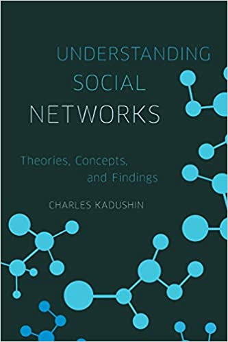
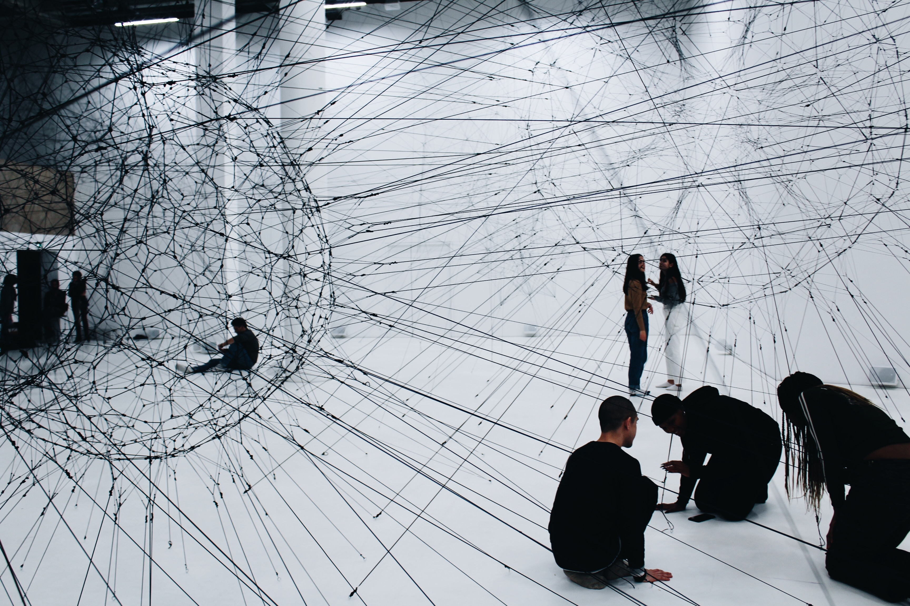

```{r setup, include=FALSE}
options(htmltools.dir.version = FALSE)

library(knitr)
library(tidyverse)
library(xaringan)
library(fontawesome)
```

class: inverse, center, middle

# `r fa("fas fa-user-friends", fill = "#fff")` <br><br> Welcome & Introductions

---

# `r fa("fas fa-chalkboard-teacher", fill = "#fff")` Meet Your Instructor!

```{r, out.width = "420px", echo = FALSE, fig.align = "center"}

```

### Bret Staudt Willet, Ph.D.

- `r fa("fas fa-chalkboard-teacher", fill = "#782F40")` Assistant Professor, [Instructional Systems & Learning Technologies](https://education.fsu.edu/islt), Florida State University
- `r fa("fas fa-globe", fill = "#782F40")` Website: http://bretsw.com
- `r fa("fab fa-twitter", fill = "#782F40")` Twitter: [@bretsw](https://twitter.com/bretsw)
- `r fa("fab fa-github", fill = "#782F40")` GitHub: [bretsw](https://github.com/bretsw/)

---

# `r fa("fas fa-people-arrows", fill = "#fff")` Meet Your Co-conspirators!

<div class="padlet-embed" style="border:1px solid rgba(0,0,0,0.1);border-radius:2px;box-sizing:border-box;overflow:hidden;position:relative;width:100%;background:#F4F4F4"><p style="padding:0;margin:0"><iframe src="https://fsu.padlet.org/embed/u39nyiwsn9rcvogg" frameborder="0" allow="camera;microphone;geolocation" style="width:100%;height:480px;display:block;padding:0;margin:0"></iframe></p><div style="padding:8px;text-align:right;margin:0;"><a href="https://padlet.com?ref=embed" style="padding:0;margin:0;border:none;display:block;line-height:1;height:16px" target="_blank"></a></div></div>

<div class="caption">
<p><a href="https://fsu.padlet.org/bretsw/u39nyiwsn9rcvogg" target="_blank">'Intros: #aectRTD SNA workshop' padlet</a></p>
</div>

---

class: inverse, center, middle

# `r fa("far fa-map", fill = "#fff")` <br><br> Workshop Information

---

# `r fa("fas fa-link", fill = "#fff")` Important Links

## Homebase

```{r child="chunks/homebase.Rmd"} 
```

--

## Agenda

```{r child="chunks/agenda.Rmd"} 
```

--

## Help

```{r child="chunks/help.Rmd"} 
```

---

class: inverse, center, middle

# `r fa("fas fa-share-alt", fill = "#fff")` <br> <br> **Part 1:** <br> Introduction to Networks

---

# `r fa("fas fa-share-alt", fill = "#fff")` Defining networks

```{r, out.width = "240px", echo = FALSE, fig.align = "center"}

```

<div class="caption">
<p>Kadushin, C. (2012). <em>Understanding social networks: Theories, concepts, and findings.</em> New York, NY: Oxford University Press.</p>
</div>

--

**Social network analysis:** (SNA; Kadushin, 2012, pp. 3–4)

--

- "set of relations between objects"

--

- "what passes through these networks"

---

# `r fa("fas fa-share-alt", fill = "#fff")` What to measure?

```{r, out.width = "720px", echo = FALSE, fig.align = "center"}

```

**Objects `r fa("fas fa-arrow-right", fill = "#782F40")` Relations `r fa("fas fa-arrow-right", fill = "#782F40")` What Passes Through**

---

# `r fa("fas fa-share-alt", fill = "#fff")` What to measure?

**Objects `r fa("fas fa-arrow-right", fill = "#782F40")` Relations `r fa("fas fa-arrow-right", fill = "#782F40")` What Passes Through**

<div class="padlet-embed" style="border:1px solid rgba(0,0,0,0.1);border-radius:2px;box-sizing:border-box;overflow:hidden;position:relative;width:100%;background:#F4F4F4"><p style="padding:0;margin:0"><iframe src="https://fsu.padlet.org/embed/mt9bov3n6809uwi" frameborder="0" allow="camera;microphone;geolocation" style="width:100%;height:420px;display:block;padding:0;margin:0"></iframe></p><div style="padding:8px;text-align:right;margin:0;"><a href="https://padlet.com?ref=embed" style="padding:0;margin:0;border:none;display:block;line-height:1;height:16px" target="_blank"></a></div></div>

<div class="caption">
<p><a href="https://fsu.padlet.org/bretsw/mt9bov3n6809uwi" target="_blank">'Measures: #aectRTD SNA workshop' padlet</a></p>
</div>

---

# `r fa("fas fa-share-alt", fill = "#fff")` SNA key terms

```{r, out.width = "420px", echo = FALSE, fig.align = "center"}

```

**Objects `r fa("fas fa-arrow-right", fill = "#782F40")` Relations `r fa("fas fa-arrow-right", fill = "#782F40")` What Passes Through**

--

- **Objects:** nodes, vertices, `r fa("fas fa-braille", fill = "#782F40")`

--

- **Relations:** edges, connections, `r fa("fas fa-grip-lines-vertical", fill = "#782F40")`

--

- **Edgelist:** two-columns: sender + receiver

  - Each column entry is a **node**
  - Each row is an **edge** (i.e., connection between two nodes)

---

# `r fa("fas fa-share-alt", fill = "#fff")` SNA key terms

- **Order:** count of nodes (vertices, objects)

--

- **Size:** count of edges (connections, relations)

--

- **Diameter:** similar to degrees of separation

--

- **Density:** out of all possible connections, percentage that have been made

--

- **Node degree:** number of connections

--

  - *In-degree:* popularity

--

  - *Out-degree:* productivity
  
--

- **Reciprocity:** mutuality

--

  - *Low reciprocity* implies hierarchical relationships (Hogan, 2017)

--

- **Transitivity:** clustering

--

  - *High transitivity* implies several highly popular or productive nodes (Hogan, 2017)

---

# `r fa("fas fa-share-alt", fill = "#fff")` SNA key terms (Hogan, 2017)

```{r, out.width = "320px", echo = FALSE, fig.align = "center"}

```

<div class="caption">
<p>Hogan, B. (2017). Online social networks: Concepts for data collection and analysis. In N. G. Fielding, R. M. Lee, & G. Blank (Eds.), <em>The SAGE handbook of online research methods</em> (2nd ed., pp. 241–258). London, UK: SAGE.</p>
</div>

---

class: inverse, center, middle

# `r fa("far fa-comments", fill = "#fff")` <br><br> Quick Check In 

- How are you doing?
- What questions remain?

---

class: inverse, center, middle

# `r fa("fas fa-list", fill = "#fff")` <br><br> Appendix: <br> Helpful Resources <br> and Troubleshooting

---

# Resources

```{r child="chunks/resources.Rmd"} 
```

---

# Troubleshooting

```{r child="chunks/troubleshooting.Rmd"} 
```

---

class: inverse, center, middle

# `r fa("fas fa-shoe-prints", fill = "#fff")` <br><br> *Next up* <br> Part 2: <br> Introduction to R

[`Part 2 slide deck here`](2-intro-R.html)