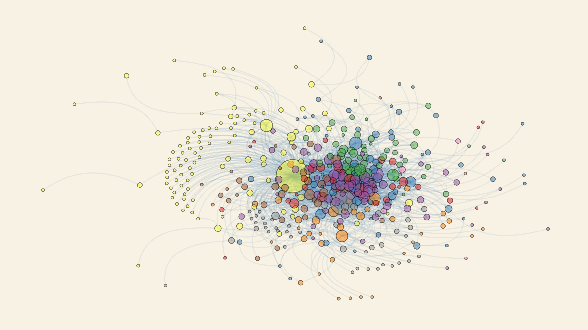
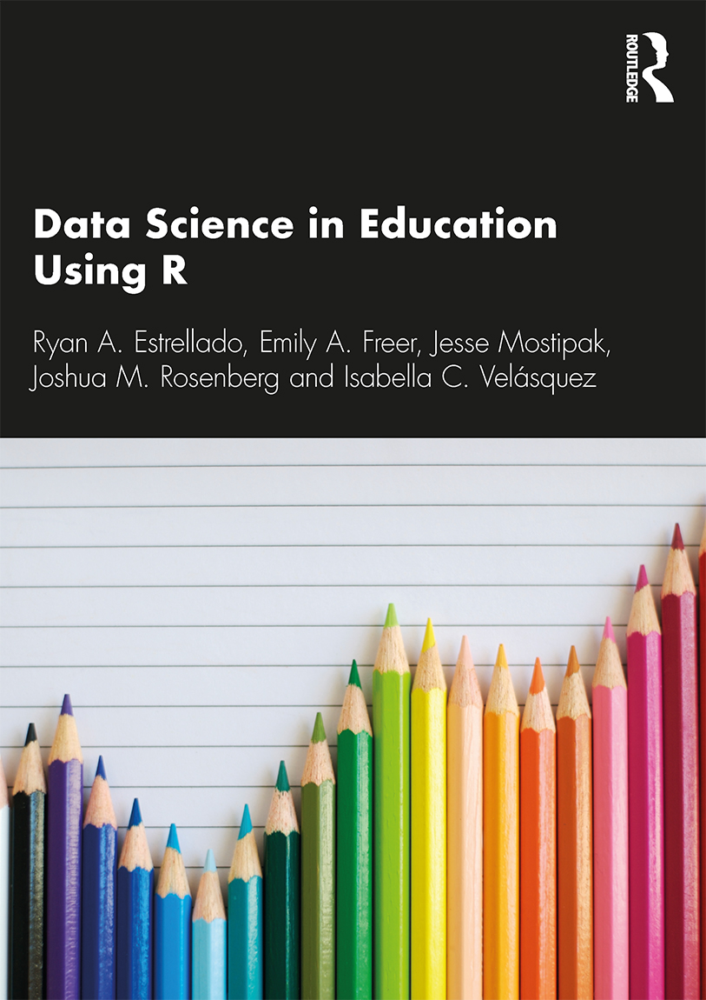

```{r setup, include=FALSE}
options(htmltools.dir.version = FALSE)

library(knitr)
library(tidyverse)
library(xaringan)
library(fontawesome)
library(igraph)
library(tidygraph)
library(ggraph)
library(ggthemes)
library(cowplot)
library(kableExtra)
```

class: inverse, center, middle

# `r fa("far fa-map", fill = "#fff")` <br><br> Workshop Information

---

# `r fa("fas fa-link", fill = "#fff")` Important Links

## Homebase

```{r child="chunks/homebase.Rmd"} 
```

## Agenda

```{r child="chunks/agenda.Rmd"} 
```

## Help

```{r child="chunks/help.Rmd"} 
```

---

class: inverse, center, middle

# `r fa("fas fa-expand-alt", fill = "#fff")` <br><br> **Part 4:** <br> Network Inference

---

# `r fa("fas fa-expand-alt", fill = "#fff")` Useful R packages

```{r, out.width = "600px", echo = FALSE, fig.align = "center"}
include_graphics("img/tools.jpg")
```

--

- `r fa("fas fa-box-open", fill = "#782F40")` [**igraph**](https://CRAN.R-project.org/package=igraph)

--

- `r fa("fas fa-box-open", fill = "#782F40")` [**ergm**](https://CRAN.R-project.org/package=ergm)

--

- `r fa("fas fa-box-open", fill = "#782F40")` [**brms**](https://CRAN.R-project.org/package=brms)

---

class: inverse, center, middle

# `r fa("fas fa-expand-alt", fill = "#fff")` <br><br> Inference 1: <br> **Clusters**

---

# `r fa("fas fa-expand-alt", fill = "#fff")` Inference 1: Clusters

```{r, out.width = "700px", echo = FALSE, fig.align = "center"}
include_graphics("img/article-cover.png")
```

**Article:** [A social network perspective on peer supported learning in MOOCs for educators ](http://www.irrodl.org/index.php/irrodl/article/view/1852) (Kellogg, Booth, & Oliver, 2014)se(edgelist1)

---

# `r fa("fas fa-expand-alt", fill = "#fff")` Inference 1: Clusters

```{r, include=FALSE}
edgelist2 <- 
  read_csv("data/DLT1 Edgelist.csv", 
           show_col_types = FALSE) %>%
  group_by(Sender, Receiver) %>% 
  mutate(Weight = n()) %>%
  distinct(Sender, Receiver, Weight)
graph2 <- 
  tidygraph::as_tbl_graph(edgelist2)
```

What do you think this code will do?

```{r, eval=FALSE}
graph2_connected <-
  graph2 %>%
  delete_vertices(which((vertex_attr(., 'in_degree') ==  0)))
clusters0 <- 
  graph2_connected %>% igraph::cluster_spinglass()
```

---

# `r fa("fas fa-expand-alt", fill = "#fff")` Inference 1: Clusters

Let's find out!

```{r, eval=TRUE}
graph2_connected <-
  graph2 %>%
  delete_vertices(which((vertex_attr(., 'in_degree') ==  0)))
clusters0 <- 
  graph2_connected %>% igraph::cluster_spinglass()
```

--

This code searches for **clusters**, or communities within the network. A **community** is a set of nodes with many edges inside the community and few edges between outside it (i.e. between the community itself and the rest of the network).

--

Specifically, this code uses the **spinglass clustering algorithm** to map community detection onto finding the ground state of an infinite range spin glass (i.e., fancy physics). In other words, the spinglass algorithm partitions the nodes into communities by optimizing an energy function.

---

# `r fa("fas fa-expand-alt", fill = "#fff")` Inference 1: Clusters

Let's find out!

```{r, eval=TRUE}
graph2_connected <-
  graph2 %>%
  delete_vertices(which((vertex_attr(., 'in_degree') ==  0)))
clusters0 <- 
  graph2_connected %>% igraph::cluster_spinglass()
```

One of the important outcomes of this method is the **modularity** value $M$. Modularity measures how good the division is, or how separated are the different vertex types from each other. 

--

The spinglass algorithm looks for the modularity of the optimal partition. For a given network, the partition with maximum modularity corresponds to the optimal community structure (i.e., a higher $M$ is better).

--

Note also that if $M$ = 0, all nodes belong to one group; if $M$ < 0, each node belongs to separate community.

--

<hr>

Our initial use of the spinglass algorithm found **`r clusters0$membership %>% unique() %>% length()` clusters** and $M$ = **`r clusters0$modularity %>% round(3)`**.

---

# `r fa("fas fa-expand-alt", fill = "#fff")` Inference 1: Clusters

It is important to note that a different result is returned each time the spinglass clustering algorithm is run. 

--

For this reason, we needed to run a number of simulations to see how many clusters the spinglass algorithm "typically" finds.

--

What do you think this code will do?

```{r, eval=FALSE}
cluster_matrix <- matrix(NA, nrow=1, ncol=1000)
for (i in 1:1000) {
        print(i)
        set.seed(i)
        csg = graph2_connected %>% igraph::cluster_spinglass()
        cluster_matrix[1,i] <- max(csg$membership)
}
```

```{r, include=FALSE, eval=FALSE}
saveRDS(cluster_matrix, "data/cluster_matrix.rds")
```

---

# `r fa("fas fa-expand-alt", fill = "#fff")` Inference 1: Clusters

Let's see!

```{r, eval=FALSE}
cluster_matrix <- matrix(NA, nrow=1, ncol=1000)
for (i in 1:1000) {
        print(i)
        set.seed(i)
        csg = graph2_connected %>% igraph::cluster_spinglass()
        cluster_matrix[1,i] <- max(csg$membership)
}
```

```{r, echo=FALSE}
cluster_matrix <- read_rds("data/cluster_matrix.rds")

cluster_matrix_summary <- 
  cluster_matrix %>% length %>%
        rbind(cluster_matrix %>% mean %>% round(2)) %>% 
        rbind(cluster_matrix %>% sd %>% round(2)) %>% 
        rbind(cluster_matrix %>% min) %>%
        rbind(cluster_matrix %>% max) %>%
        rbind(cluster_matrix %>% median)
colnames(cluster_matrix_summary) <- c("")
rownames(cluster_matrix_summary) <- c("number of tests: ", "mean: ", "sd: ", "min: ", "max: ", "median: ")

cluster_matrix_summary %>%
  kable(align='l') %>% 
  kable_styling(c("striped", "bordered"))
```

---

# `r fa("fas fa-expand-alt", fill = "#fff")` Inference 1: Clusters

What do you think this code will do?

```{r, eval=FALSE}
seeds <- which(as.vector(cluster_matrix) == median(cluster_matrix))
cluster_seed <- seeds %>% sample(1)
```

```{r, include=FALSE, eval=FALSE}
saveRDS(cluster_seed, "data/cluster-seed.rds")
```

---

# `r fa("fas fa-expand-alt", fill = "#fff")` Inference 1: Clusters

Let's see!

```{r, include=FALSE}
cluster_seed <- read_rds("data/cluster-seed.rds")
```

```{r, include=FALSE}
set.seed(cluster_seed)
clusters <- 
  graph2_connected %>% 
  igraph::cluster_spinglass()
```

```{r, echo=FALSE}
cluster_summary <- 
  tibble(Measure = c("Number of nodes: ", "Number of edges: ", 
                     "Modularity: ", "Number of clusters: ", 
                     "Size of cluster 1: ", "Size of cluster 2: ",
                     "Size of cluster 3: ", "Size of cluster 4: ",
                     "Size of cluster 5: ", "Size of cluster 6: ",
                     "Size of cluster 7: ", "Size of cluster 8: ",
                     "Size of cluster 9: "
                     ),
         Score = c(clusters$vcount,
                   gsize(graph2_connected),
                   round(clusters$modularity, 2),
                   length(clusters),
                   clusters$csize
         )
  ) %>%
  column_to_rownames('Measure')

cluster_summary %>% 
  kable(align='l') %>% 
  kable_styling(c("striped", "bordered"),
                full_width = FALSE)
```

---

# `r fa("fas fa-expand-alt", fill = "#fff")` Inference 1: Clusters

We also want to see if these clusters appear merely by random chance, or if the interaction patterns are likely to be nonrandom. 

--

Testing statistical significance for spinglass clustering is a bit different than the familiar tests that return $p$-values.

--

The idea behind this test of significance is that a random network of equal size and degree distribution as our studied network should have a lower modularity score--that is, if the observed network does in fact have statistically significant clustering.

--

The testing strategy is to generate 100 randomized instances of our network with the same size and degree distribution using the `sample_ degseq()` function.

---

# `r fa("fas fa-expand-alt", fill = "#fff")` Inference 1: Clusters

What do you think this code will do?

```{r, eval=FALSE}
degrees <- 
  graph2_connected %>% 
  igraph::as.undirected() %>% 
  igraph::degree(mode='all')

random_modularities <- 
  replicate(100, 
            igraph::sample_degseq(degrees, method="vl"), 
            simplify=FALSE) %>%
  lapply(igraph::cluster_spinglass) %>%
  sapply(igraph::modularity)
```

```{r, include=FALSE, eval=FALSE}
saveRDS(random_modularities, "data/random-modularities.rds")
```

---

# `r fa("fas fa-expand-alt", fill = "#fff")` Inference 1: Clusters

Let's see!

```{r, eval=FALSE}
degrees <- 
  graph2_connected %>% 
  igraph::as.undirected() %>% 
  igraph::degree(mode='all')

random_modularities <- 
  replicate(100, 
            igraph::sample_degseq(degrees, method="vl"), 
            simplify=FALSE) %>%
  lapply(igraph::cluster_spinglass) %>%
  sapply(igraph::modularity)
```

```{r, include=FALSE}
random_modularities <- read_rds("data/random-modularities.rds")
```

--

A '0' result from this procedure indicates that no randomized networks have community structure with a modularity score that is higher than the one obtained from the original, observed network. Hence a '0' result means that our network has significant community structure; any non-zero results means that the detected spinglass clusters are not statistically significant.

--

Our testing strategy returned a result of **`r sum(random_modularities > clusters$modularity) / 100`**.

---

# `r fa("fas fa-expand-alt", fill = "#fff")` Inference 1: Clusters

What do you think this code will do?

```{r}
cluster_membership <-
  clusters$membership %>%
  as.character()

graph2_clustered <- 
  graph2_connected %>%
  igraph::set_vertex_attr(name = 'popularity', 
                  value = degree(graph2_connected, mode = 'in')) %>%
  igraph::set_vertex_attr(name = 'grp', 
                  value = cluster_membership) %>%
  set_edge_attr(name='grp_weight', 
                value=ifelse(igraph::crossing(clusters, graph2_connected), 1, 15))
```

---

# `r fa("fas fa-expand-alt", fill = "#fff")` Inference 1: Clusters

```{r}
sociogram2_clustered <-
  graph2_clustered %>%
  ggraph(layout = 'fr') +
  geom_edge_arc(alpha = .1, 
                width = .5, 
                strength = .5,
                color = 'steelblue'
  ) +
  geom_node_point(aes(size = popularity,
                      fill = grp),
                  alpha = .5,
                  color = 'black',
                  shape = 21
  ) +
  scale_fill_brewer(palette = 'Set1', guide = 'none') +
  scale_size(range = c(1,15), guide = 'none') +
  theme_wsj() +
  theme(axis.line=element_blank(),
        axis.text.x=element_blank(), axis.text.y=element_blank(),
        axis.ticks.x =element_blank(), axis.ticks.y =element_blank(),
        axis.title.x=element_blank(), axis.title.y=element_blank(),
        panel.background=element_blank(), panel.border=element_blank(),
        panel.grid.major=element_blank(), panel.grid.minor=element_blank())
```

---

# `r fa("fas fa-expand-alt", fill = "#fff")` Inference 1: Clusters

```{r, out.width = "100%", echo = FALSE, fig.align = "center"}
ggsave(plot = sociogram2_clustered, "img/sociogram2-clustered.png", width = 8, height = 4.5)

```

---

class: inverse, center, middle

# `r fa("fas fa-expand-alt", fill = "#fff")` <br><br> Inference 2: <br> **Influence** and **Selection**

---

# `r fa("fas fa-expand-alt", fill = "#fff")` Inference 2

### **Influence** and **Selection**

```{r, out.width = "280px", echo = FALSE, fig.align = "center"}

```

---

# `r fa("fas fa-expand-alt", fill = "#fff")` Inference 2

### **Influence** and **Selection**

Unfortunately, we don't have time to get into the important, but quite advanced, topics of SNA inference of **influence** and **selection**. I hope you'll keep exploring these areas, and I highly recommend three sources of information, in increasing order of difficulty:

--

1. [Chapter 20.3 Appendix C](https://datascienceineducation.com/c20.html#c20c) - "Social Network Influence and Selection Models" in the wonderful guide, [*Data Science in Education Using R*](https://datascienceineducation.com).

--

1. The article "Idle chatter or compelling conversation? The potential of the social media-based #NGSSchat network for supporting science education reform efforts" in *Journal of Research in Science  written by my colleague [Josh Rosenberg](https://joshuamrosenberg.com/).

--

1. A trove of SNA resources on the website of [Ken Frank](https://sites.google.com/msu.edu/kenfrank/social-network-resources), Professor at Michigan State University.

---

class: inverse, center, middle

# `r fa("fas fa-code", fill = "#fff")` <br><br> Try it out!

Hop over to [**Workspace 4**](workspace4.Rmd)

---

class: inverse, center, middle

# `r fa("far fa-comments", fill = "#fff")` <br><br> Quick Check In 

**(Five minutes in groups, five minutes together)**

- What challenges did you encounter?
- What successes did you have?
- What questions remain?

---

class: inverse, center, middle

# `r fa("fas fa-map-marker-alt", fill = "#fff")` <br><br> Recap

```{r child="chunks/agenda.Rmd"} 
```

---

class: inverse, center, middle

# `r fa("fas fa-list", fill = "#fff")` <br><br> Appendix: <br> Helpful Resources <br> and Troubleshooting

---

# Resources

```{r child="chunks/resources.Rmd"} 
```

---

# Troubleshooting

```{r child="chunks/troubleshooting.Rmd"} 
```

---

class: inverse, center, middle

# `r fa("fas fa-shoe-prints", fill = "#fff")` <br><br> *Next up* <br> Choose Your Own Adventure!
