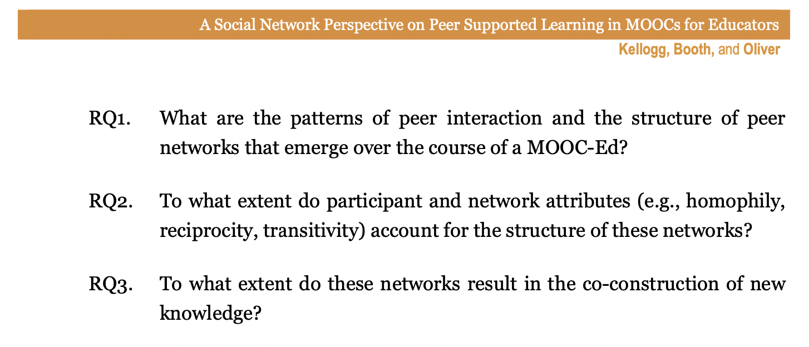
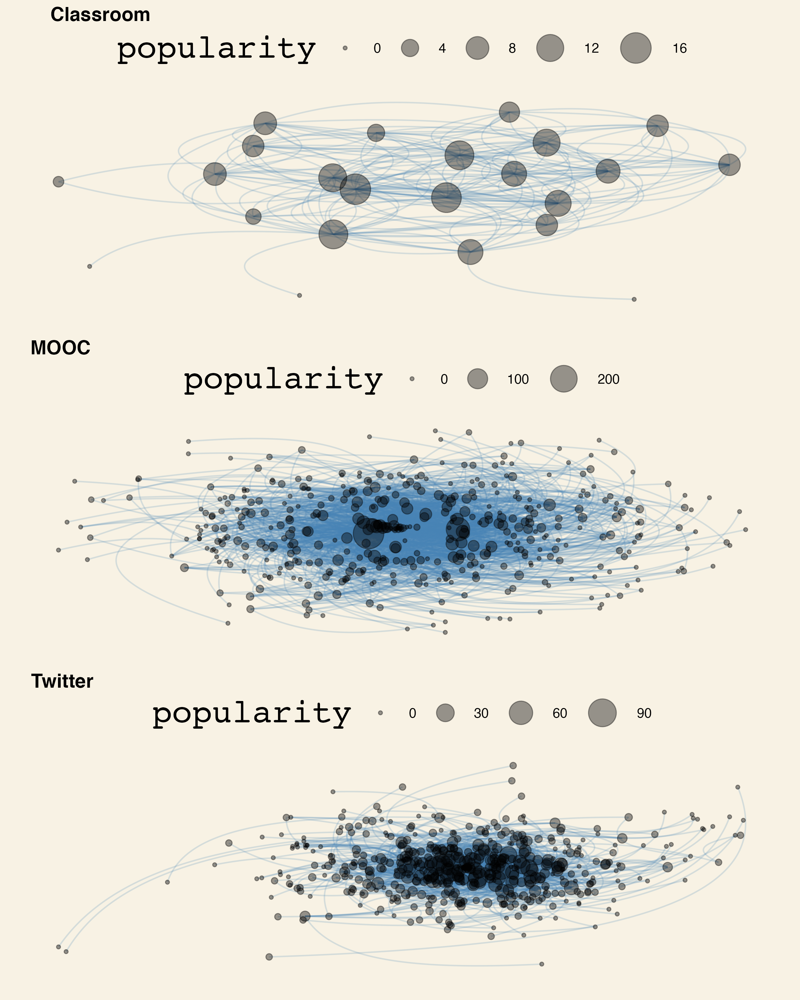

```{r setup, include=FALSE}
options(htmltools.dir.version = FALSE)

library(knitr)
library(tidyverse)
library(xaringan)
library(fontawesome)
library(igraph)
library(tidygraph)
library(ggraph)
library(ggthemes)
library(cowplot)
library(kableExtra)
#install.packages("tidytags", repos = "https://ropensci.r-universe.dev")
library(tidytags)
```

class: inverse, center, middle

# `r fa("far fa-map", fill = "#fff")` <br><br> Workshop Information

---

# `r fa("fas fa-link", fill = "#fff")` Important Links

## Homebase

```{r child="chunks/homebase.Rmd"} 
```

## Agenda

```{r child="chunks/agenda.Rmd"} 
```

## Help

```{r child="chunks/help.Rmd"} 
```

---

class: inverse, center, middle

# `r fa("fas fa-ruler", fill = "#fff")` <br><br> **Part 3:** <br> Network Description

---

# `r fa("fas fa-ruler", fill = "#fff")` Useful R packages

```{r, out.width = "600px", echo = FALSE, fig.align = "center"}
include_graphics("img/tools.jpg")
```

--

- `r fa("fas fa-box-open", fill = "#782F40")` [**igraph**](https://CRAN.R-project.org/package=igraph)

--

- `r fa("fas fa-box-open", fill = "#782F40")` [**tidygraph**](https://CRAN.R-project.org/package=tidygraph)

--

- `r fa("fas fa-box-open", fill = "#782F40")` [**ggraph**](https://CRAN.R-project.org/package=ggraph)

---

class: inverse, center, middle

# `r fa("fas fa-ruler", fill = "#fff")` <br><br> **Network** <br> Example 1

---

# `r fa("fas fa-ruler", fill = "#fff")` Network Example 1

`r fa("fab fa-github", fill = "#782F40")` **Discussion Social Network Analysis:** [GitHub repository from @meteakca](https://github.com/meteakca/DiscussionSNA)

--

What do you think this code will do?

```{r, eval=FALSE}
edgelist1 <- 
  read_csv("data/meteakca_edgelist.csv", 
           show_col_types = FALSE) %>%
  mutate(group = week,
         week = substr(week, 1, 1)
         ) %>% 
  group_by(from, to) %>% 
  mutate(weight = n())
glimpse(edgelist1)
```

---

# `r fa("fas fa-ruler", fill = "#fff")` Network Example 1

`r fa("fab fa-github", fill = "#782F40")` **Discussion Social Network Analysis:** [GitHub repository from @meteakca](https://github.com/meteakca/DiscussionSNA)

Let's see!

```{r, eval=TRUE}
edgelist1 <- 
  read_csv("data/meteakca_edgelist.csv", 
           show_col_types = FALSE) %>%
  mutate(group = week,
         week = substr(week, 1, 1)
         ) %>% 
  group_by(from, to) %>% 
  mutate(weight = n()) %>%
  distinct(from, to, weight)
glimpse(edgelist1)
```

---

# `r fa("fas fa-ruler", fill = "#fff")` Network Example 1

```{r}
head(edgelist1, 15)
```

---

# `r fa("fas fa-ruler", fill = "#fff")` Network Example 1

```{r}
graph1 <- tidygraph::as_tbl_graph(edgelist1)
```

--

- **Order:** `igraph::gorder(graph1)` = `r igraph::gorder(graph1)`

--

- **Size:** `igraph::gsize(graph1)` = `r igraph::gsize(graph1)`

--

- **Diameter:** `igraph::diameter(graph1)` = `r igraph::diameter(graph1)`

--

- **Density:** `igraph::edge_density(graph1)` = `r igraph::edge_density(graph1) %>% round(3)`

--

- **Node degree:** `igraph::degree(graph1, mode = 'all')` = `r median(igraph::degree(graph1, mode = 'all'))`

--

  - *In-degree:* `igraph::degree(graph1, mode = 'in')` = `r median(igraph::degree(graph1, mode = 'in'))`

--

  - *Out-degree:* `igraph::degree(graph1, mode = 'out')` = `r median(igraph::degree(graph1, mode = 'out'))`

--

- **Reciprocity:** `igraph::reciprocity(graph1)` = `r igraph::reciprocity(graph1) %>% round(3)`

--

- **Transitivity:** `igraph::transitivity(graph1)` = `r igraph::transitivity(graph1) %>% round(3)`

---

# `r fa("fas fa-ruler", fill = "#fff")` Network Example 1

What do you think this code will do?

```{r, eval=FALSE}
sociogram1 <-
  graph1 %>%
  mutate(popularity = centrality_degree(mode = 'in')) %>%
  ggraph(layout = 'kk') +
  geom_edge_arc(alpha = .2, 
                width = .5, 
                strength = .5,
                color = 'steelblue'
  ) +
  geom_node_point(alpha = .4, aes(size = popularity)) +
  scale_size(range = c(1,10)) +
  theme_wsj() + 
  scale_colour_wsj("colors6") +
  theme(axis.line=element_blank(),
        axis.text.x=element_blank(), axis.text.y=element_blank(),
        axis.ticks.x =element_blank(), axis.ticks.y =element_blank(),
        axis.title.x=element_blank(), axis.title.y=element_blank(),
        panel.background=element_blank(), panel.border=element_blank(),
        panel.grid.major=element_blank(), panel.grid.minor=element_blank())
```

---

# `r fa("fas fa-ruler", fill = "#fff")` Network Example 1

Let's see!

```{r, eval=TRUE}
sociogram1 <-
  graph1 %>%
  mutate(popularity = centrality_degree(mode = 'in')) %>%
  ggraph(layout = 'kk') +
  geom_edge_arc(alpha = .2, 
                width = .5, 
                strength = .5,
                color = 'steelblue'
  ) +
  geom_node_point(alpha = .4, aes(size = popularity)) +
  scale_size(range = c(1,10)) +
  theme_wsj() + 
  scale_colour_wsj("colors6") +
  theme(axis.line=element_blank(),
        axis.text.x=element_blank(), axis.text.y=element_blank(),
        axis.ticks.x =element_blank(), axis.ticks.y =element_blank(),
        axis.title.x=element_blank(), axis.title.y=element_blank(),
        panel.background=element_blank(), panel.border=element_blank(),
        panel.grid.major=element_blank(), panel.grid.minor=element_blank())
```

---

# `r fa("fas fa-ruler", fill = "#fff")` Network Example 1

```{r, out.width = "100%", echo = FALSE, fig.align = "center"}
ggsave(plot = sociogram1, "img/sociogram1.png", width = 8, height = 4.5)

```

--

### `r fa("fas fa-shoe-prints", fill = "#782F40")` **Next step:** Look at the network by group or by week

---

class: inverse, center, middle

# `r fa("fas fa-ruler", fill = "#fff")` <br><br> **Network** <br> Example 2

---

# `r fa("fas fa-ruler", fill = "#fff")` Network Example 2

```{r, out.width = "700px", echo = FALSE, fig.align = "center"}

```

**Article:** [A social network perspective on peer supported learning in MOOCs for educators ](http://www.irrodl.org/index.php/irrodl/article/view/1852) (Kellogg, Booth, & Oliver, 2014)

---

# `r fa("fas fa-ruler", fill = "#fff")` Network Example 2

```{r, out.width = "700px", echo = FALSE, fig.align = "center"}
include_graphics("img/data-cover.png")
```

**Data source:** [Massively Open Online Course for Educators (MOOC-Ed) network dataset](https://dataverse.harvard.edu/dataset.xhtml;jsessionid=9ad052693563b29056a88d490182?persistentId=doi%3A10.7910%2FDVN%2FZZH3UB&version=&q=&fileTypeGroupFacet=&fileAccess=&fileSortField=name&fileSortOrder=desc)]

---

# `r fa("fas fa-ruler", fill = "#fff")` Network Example 2

```{r, out.width = "100%", echo = FALSE, fig.align = "center"}

```

---

# `r fa("fas fa-ruler", fill = "#fff")` Network Example 2

What do you think this code will do?

```{r, eval=FALSE}
edgelist2 <- 
  read_csv("data/DLT1 Edgelist.csv", 
           show_col_types = FALSE) %>%
  group_by(Sender, Receiver) %>% 
  mutate(Weight = n()) %>%
  ungroup() %>%
  relocate(Sender, Receiver, Weight)
  
glimpse(edgelist2)
```

---

# `r fa("fas fa-ruler", fill = "#fff")` Network Example 2

Let's see!

```{r, eval=TRUE}
edgelist2 <- 
  read_csv("data/DLT1 Edgelist.csv", 
           show_col_types = FALSE) %>%
  group_by(Sender, Receiver) %>% 
  mutate(Weight = n()) %>%
  distinct(Sender, Receiver, Weight)
glimpse(edgelist2)
```

---

# `r fa("fas fa-ruler", fill = "#fff")` Network Example 2

```{r}
head(edgelist2, 15)
```

---

# `r fa("fas fa-ruler", fill = "#fff")` Network Example 2

```{r}
graph2 <- tidygraph::as_tbl_graph(edgelist2)
```

- **Order:** `igraph::gorder(graph2)` = `r igraph::gorder(graph2)`

- **Size:** `igraph::gsize(graph2)` = `r igraph::gsize(graph2)`

- **Diameter:** `igraph::diameter(graph2)` = `r igraph::diameter(graph2)`

- **Density:** `igraph::edge_density(graph2)` = `r igraph::edge_density(graph2) %>% round(3)`

- **Node degree:** `igraph::degree(graph2, mode = 'all')` = `r median(igraph::degree(graph2, mode = 'all'))`

  - *In-degree:* `igraph::degree(graph2, mode = 'in')` = `r median(igraph::degree(graph2, mode = 'in'))`
  
  - *Out-degree:* `igraph::degree(graph2, mode = 'out')` = `r median(igraph::degree(graph2, mode = 'out'))`
  
- **Reciprocity:** `igraph::reciprocity(graph2)` = `r igraph::reciprocity(graph2) %>% round(3)`

- **Transitivity:** `igraph::transitivity(graph2)` = `r igraph::transitivity(graph2) %>% round(3)`

---

# `r fa("fas fa-ruler", fill = "#fff")` Network Example 2

```{r}
sociogram2 <-
  graph2 %>%
  mutate(popularity = centrality_degree(mode = 'in')) %>%
  ggraph(layout = 'kk') +
  geom_edge_arc(alpha = .2, 
                width = .5, 
                strength = .5,
                color = 'steelblue'
  ) +
  geom_node_point(alpha = .4, aes(size = popularity)) +
  scale_size(range = c(1,10)) +
  theme_wsj() + 
  scale_colour_wsj("colors6") +
  theme(axis.line=element_blank(),
        axis.text.x=element_blank(), axis.text.y=element_blank(),
        axis.ticks.x =element_blank(), axis.ticks.y =element_blank(),
        axis.title.x=element_blank(), axis.title.y=element_blank(),
        panel.background=element_blank(), panel.border=element_blank(),
        panel.grid.major=element_blank(), panel.grid.minor=element_blank())
```

---

# `r fa("fas fa-ruler", fill = "#fff")` Network Example 2

```{r, out.width = "100%", echo = FALSE, fig.align = "center"}
ggsave(plot = sociogram2, "img/sociogram2.png", width = 8, height = 4.5)

```

---

class: inverse, center, middle

# `r fa("fas fa-ruler", fill = "#fff")` <br><br> **Network** <br> Example 3

---

# `r fa("fas fa-ruler", fill = "#fff")` Network Example 3

```{r, out.width = "360px", echo = FALSE, fig.align = "center"}
include_graphics("img/tidytags-logo.png")
```

**R package demo:** [Using tidytags with a conference hashtag](https://docs.ropensci.org/tidytags/articles/tidytags-with-conf-hashtags.html) (Staudt Willet & Rosenberg, 2022)

---

# `r fa("fas fa-ruler", fill = "#fff")` Network Example 3

What do you think this code will do?

```{r, eval=FALSE}
google_sheet_url <- "18clYlQeJOc6W5QRuSlJ6_v3snqKJImFhU42bRkM_OX8"

google_sheet_data <- 
  google_sheet_url %>%
  tidytags::read_tags()

extra_tweet_data <- 
  tidytags::pull_tweet_data(google_sheet_data) %>%
  tidytags::process_tweets()

edgelist3 <- 
  tidytags::create_edgelist(extra_tweet_data) %>%
  group_by(sender, receiver) %>% 
  mutate(weight = n()) %>%
  distinct(sender, receiver, weight)
```

```{r, eval=FALSE}
write_csv(edgelist3, "data/tidytags-edgelist.csv")
```

---

# `r fa("fas fa-ruler", fill = "#fff")` Network Example 3

Let's see!

```{r}
edgelist3 <-
  read_csv("data/tidytags-edgelist.csv", 
           show_col_types = FALSE) 
glimpse(edgelist3)
```

---

# `r fa("fas fa-ruler", fill = "#fff")` Network Example 3

```{r}
head(edgelist3, 15)
```

---

# `r fa("fas fa-ruler", fill = "#fff")` Network Example 3

```{r}
graph3 <- tidygraph::as_tbl_graph(edgelist3)
```

- **Order:** `igraph::gorder(graph3)` = `r igraph::gorder(graph3)`

- **Size:** `igraph::gsize(graph3)` = `r igraph::gsize(graph3)`

- **Diameter:** `igraph::diameter(graph3)` = `r igraph::diameter(graph3)`

- **Density:** `igraph::edge_density(graph3)` = `r igraph::edge_density(graph3) %>% round(3)`

- **Node degree:** `igraph::degree(graph3, mode = 'all')` = `r median(igraph::degree(graph3, mode = 'all'))`

  - *In-degree:* `igraph::degree(graph3, mode = 'in')` = `r median(igraph::degree(graph3, mode = 'in'))`
  
  - *Out-degree:* `igraph::degree(graph3, mode = 'out')` = `r median(igraph::degree(graph3, mode = 'out'))`
  
- **Reciprocity:** `igraph::reciprocity(graph3)` = `r igraph::reciprocity(graph3) %>% round(3)`

- **Transitivity:** `igraph::transitivity(graph3)` = `r igraph::transitivity(graph3) %>% round(3)`

---

# `r fa("fas fa-ruler", fill = "#fff")` Network Example 3

```{r}
sociogram3 <-
  graph3 %>%
  mutate(popularity = centrality_degree(mode = 'in')) %>%
  ggraph(layout = 'kk') +
  geom_edge_arc(alpha = .2, 
                width = .5, 
                strength = .5,
                color = 'steelblue'
  ) +
  geom_node_point(alpha = .4, aes(size = popularity)) +
  scale_size(range = c(1,10)) +
  theme_wsj() + 
  scale_colour_wsj("colors6") +
  theme(axis.line=element_blank(),
        axis.text.x=element_blank(), axis.text.y=element_blank(),
        axis.ticks.x =element_blank(), axis.ticks.y =element_blank(),
        axis.title.x=element_blank(), axis.title.y=element_blank(),
        panel.background=element_blank(), panel.border=element_blank(),
        panel.grid.major=element_blank(), panel.grid.minor=element_blank())
```

---

# `r fa("fas fa-ruler", fill = "#fff")` Network Example 3

```{r, out.width = "100%", echo = FALSE, fig.align = "center"}
ggsave(plot = sociogram3, "img/sociogram3.png", width = 8, height = 4.5)

```

---

class: inverse, center, middle

# `r fa("fas fa-ruler", fill = "#fff")` <br><br> **Network** <br> Comparing networks

---

# `r fa("fas fa-ruler", fill = "#fff")` Comparing networks

```{r, out.width = "420px", echo=FALSE, fig.align="center"}
sociogram1_2_3 <- 
  cowplot::plot_grid(sociogram1, sociogram2, sociogram3,
                     ncol = 1,
                     labels = c("Classroom", "MOOC", "Twitter"))
ggsave(plot = sociogram1_2_3, "img/sociogram-comparison.png", width = 8, height = 10)

```

---

# `r fa("fas fa-ruler", fill = "#fff")` Comparing networks

```{r, include=FALSE}
names <- c("Order", "Size", "Diameter", "Density", 
           "Median Degree", "In-Degree", "Out-Degree", 
           "Reciprocity", "Transitivity")
measures1 <- 
  c(igraph::gorder(graph1), igraph::gsize(graph1),
    igraph::diameter(graph1), igraph::edge_density(graph1),
    median(igraph::degree(graph1, mode = 'all')),
    median(igraph::degree(graph1, mode = 'in')),
    median(igraph::degree(graph1, mode = 'out')),
    igraph::reciprocity(graph1), igraph::transitivity(graph1)
  ) %>% round(3)
measures2 <-
  c(igraph::gorder(graph2), igraph::gsize(graph2),
    igraph::diameter(graph2), igraph::edge_density(graph2),
    median(igraph::degree(graph2, mode = 'all')),
    median(igraph::degree(graph2, mode = 'in')),
    median(igraph::degree(graph2, mode = 'out')),
    igraph::reciprocity(graph2), igraph::transitivity(graph2)
  ) %>% round(3)
measures3 <-
  c(igraph::gorder(graph3), igraph::gsize(graph3),
    igraph::diameter(graph3), igraph::edge_density(graph3),
    median(igraph::degree(graph3, mode = 'all')),
    median(igraph::degree(graph3, mode = 'in')),
    median(igraph::degree(graph3, mode = 'out')),
    igraph::reciprocity(graph3), igraph::transitivity(graph3)
  ) %>% round(3)
comparison <-
  names %>%
  bind_cols(measures1) %>%
  bind_cols(measures2) %>%
  bind_cols(measures3)

comparison_kable <- 
  comparison %>% 
  kable(align='c',
        col.names = c("Variable", "Classroom", "MOOC", "Twitter")
        ) %>% 
  kable_styling(c("striped", "bordered"))
save_kable(comparison_kable, "img/comparison-table.png")  # requires webshot::install_phantomjs()
```

`r comparison_kable`

---

class: inverse, center, middle

# `r fa("fas fa-code", fill = "#fff")` <br><br> Try it out!

Hop over to [**Workspace 2**](workspace2.Rmd)

---

class: inverse, center, middle

# `r fa("far fa-comments", fill = "#fff")` <br><br> Quick Check In 

**(Five minutes in groups, five minutes together)**

- What challenges did you encounter?
- What successes did you have?
- What questions remain?

---

class: inverse, center, middle

# `r fa("fas fa-list", fill = "#fff")` <br><br> Appendix: <br> Helpful Resources <br> and Troubleshooting

---

# Resources

```{r child="chunks/resources.Rmd"} 
```

---

# Troubleshooting

```{r child="chunks/troubleshooting.Rmd"} 
```

---

class: inverse, center, middle

# `r fa("fas fa-shoe-prints", fill = "#fff")` <br><br> *Next up* <br> Part 4: <br> Network Inference

[`Part 4 slide deck here`](4-inference.html)
